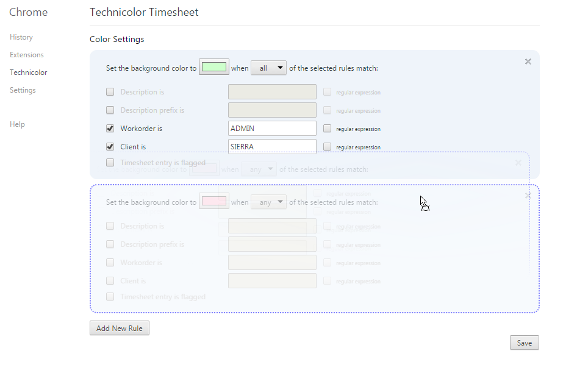
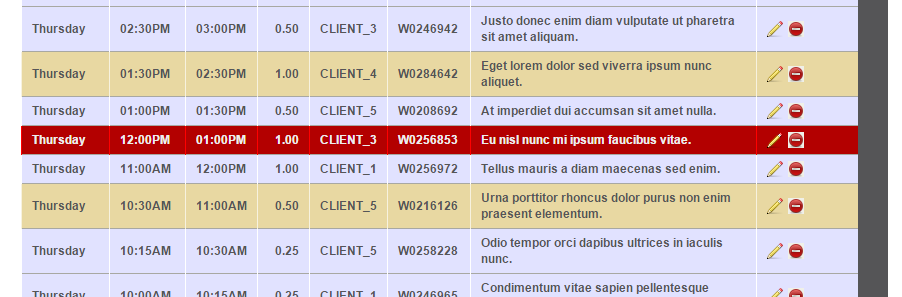

# Technicolor Timesheet

Adds configurable colorization rules for timesheet entries
based on client, description, prefix, flagged status, and optionally with regular expressions.

## Options page

## Timesheet page
